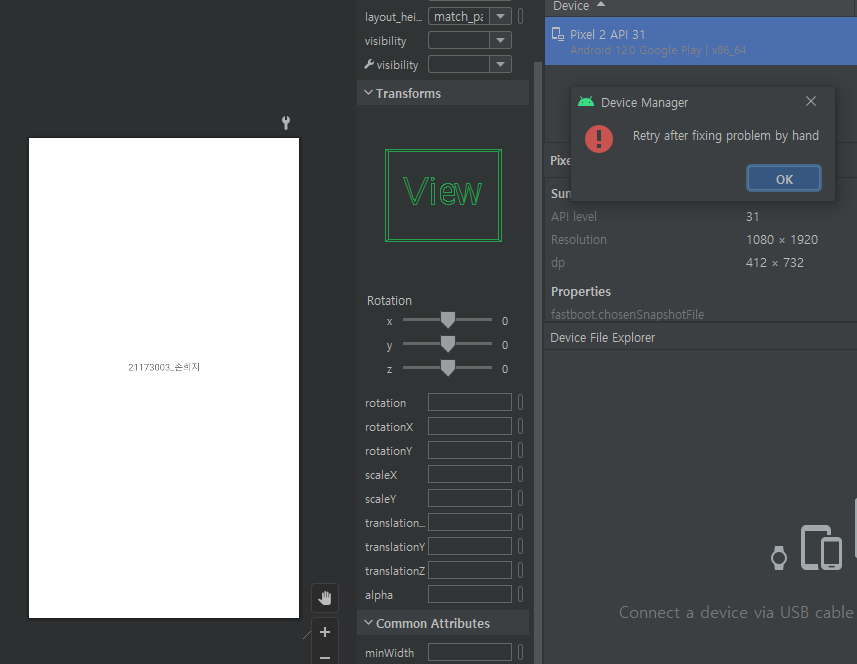
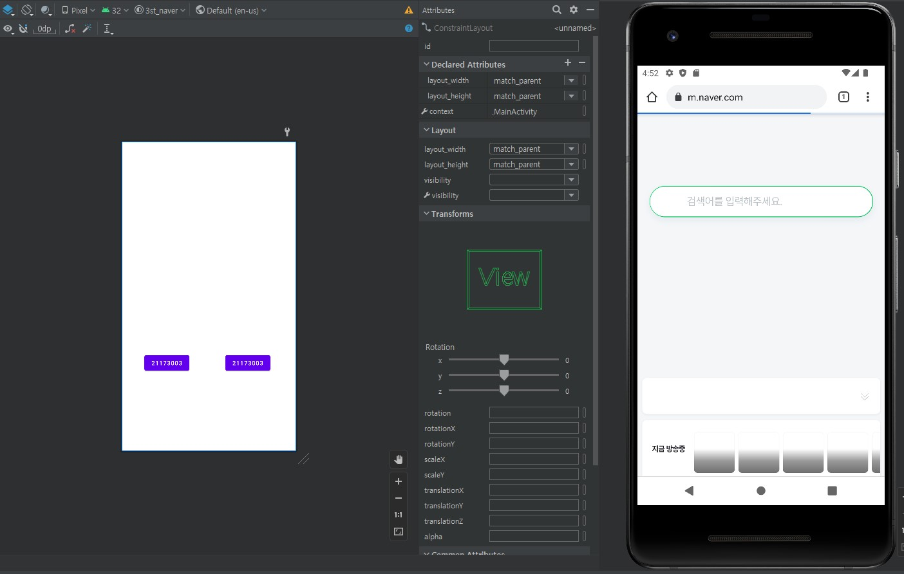

# 2주차 (2022-03-15)
- 안드로이드 스튜디오 설치 & 깃허브 가입 및 레포지토리 만듬
</img>
- 가상화 사용안함 (에뮬레이터 실행 불가)

# 3주차 (2022-03-22)
실행 첫화면 & 네이버 모바일 웹 띄우기 화면 & 전화걸기 화면
</img>
</img>
</img>

# 4주차 (2022-03-23)
Toast 메세지
</img>

# 5주차 (2022-03-30)
이미지 바꾸기 버튼 프로젝트

</img>
</img>
</img>
</img>

# 6주차 (2022-04-06)
두개의 버튼을 추가 삽입 

# 10주차 (2022-05-04)
여러 화면 만들고 화면 간 전환하기
(오류로 실행을 할수 없어 코드를 대신해 올립니다)

</img>
</img>
</img>

# 11주차 (2022-05-11)
웹으로 요청하기 결과 캡처 화면 
</img>

